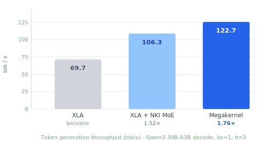

# Qwen3-30B-A3B Megakernel for Trainium

A full-model NKI megakernel for Qwen3-30B-A3B decode inference on AWS Trainium 2/3. All 48 decoder layers run in a single NKI jit invocation — no HBM round-trips between layers.

## Results

End-to-end on Trainium 3, 640 output tokens, bs=1:

| | XLA | XLA + NKI MoE | Megakernel |
|---|---|---|---|
| Token gen latency p50 | 14.37 ms | 9.43 ms | **8.15 ms** |
| Token gen throughput | 69.7 tok/s | 106.3 tok/s | **122.7 tok/s** |
| E2E throughput | 65.9 tok/s | 97.3 tok/s | **110.7 tok/s** |
| vs. XLA | — | 1.52× | **1.76×** |

"XLA + NKI MoE" replaces expert computation with the NKI Library MoE TKG kernel; attention stays in XLA. "Megakernel" runs all 48 decoder layers entirely in NKI with custom attention and MoE kernels.



**Per-layer breakdown** (comparing the megakernel against the XLA + NKI MoE hybrid, profiled with the Neuron Explorer):

| Metric | XLA + NKI MoE | Megakernel | Δ |
|---|---|---|---|
| Wall time / layer | 165.26 μs | 134.47 μs | **−30.80 μs (18.5%)** |
| Sync engine | 53.52 μs | 19.05 μs | −34.47 μs |
| DMA active | 91.99 μs | 66.50 μs | −25.49 μs |
| Tensor engine | 48.86 μs | 48.15 μs | −0.71 μs |
| CC ops (AllReduce) | 13.45 μs | 27.77 μs | +14.32 μs |

The sync engine savings come from eliminating ~98 graph boundaries per decoder block. DMA efficiency improves significantly — 43% fewer packets, each 2.7× larger on average.

## Design

The megakernel fuses the entire Qwen3-30B-A3B decoder stack (input layernorm through residual add) into two subkernels per layer, chained across all 48 layers with the residual hidden state kept in Sbuf throughout.

**Attention subkernel** — RMSNorm → QKV projections → RoPE → KV cache update → scaled dot-product attention → output projection → AllReduce.

**MoE subkernel** — RMSNorm → router top-k → selective weight loading → gate/up/down expert GEMMs → weighted sum → AllReduce.

LNC=2 is used throughout. KV heads (4 total) are sharded across 4 LNCs within a single chip. `SbufManager` handles on-chip memory allocation and weight double-buffering across layers.

## Setup

Tested on Trainium 2 and 3 with AWS Neuron SDK v2.27.

```bash
# 1. Activate the Neuron venv
source /opt/aws_neuronx_venv_pytorch_2_9_nxd_inference/bin/activate

# 2. Clone and enter the repo
git clone https://github.com/KevGomes1403/nki-moe && cd nki-moe

# 3. Download the model weights
pip install huggingface_hub[cli]
huggingface-cli download Qwen/Qwen3-30B-A3B --local-dir ~/qwen-30b-a3b/hf_model
```

## Running

```bash
# Baseline (XLA)
python main.py --mode generate \
  --model-path ~/qwen-30b-a3b/hf_model \
  --compiled-model-path ~/qwen-30b-a3b/traced_model \
  --prompt "What is the capital of France?"

# Megakernel
python main.py --mode generate --enable-nki \
  --model-path ~/qwen-30b-a3b/hf_model \
  --compiled-model-path ~/qwen-30b-a3b/traced_nki_model \
  --prompt "What is the capital of France?"

# Benchmark
python main.py --mode benchmark --enable-nki \
  --model-path ~/qwen-30b-a3b/hf_model \
  --compiled-model-path ~/qwen-30b-a3b/traced_nki_model
```

When switching between baseline and megakernel, clear the compile cache:

```bash
rm -rf ~/qwen-30b-a3b/traced_nki_model /var/tmp/neuron-compile-cache/*
```

## Repository Layout

```
qwen.py                                   # Baseline XLA model
qwen_with_nki.py                          # Megakernel model (--enable-nki)
main.py                                   # Entry point: generate / validate / benchmark
kernels/
  attn_tkg/attn_fused_nki.py             # Attention subkernel
  moe_fused_tkg/moe_fused_nki.py         # MoE subkernel
  transformer/transformer_qwen_multilayer.py  # Top-level 48-layer loop
```
